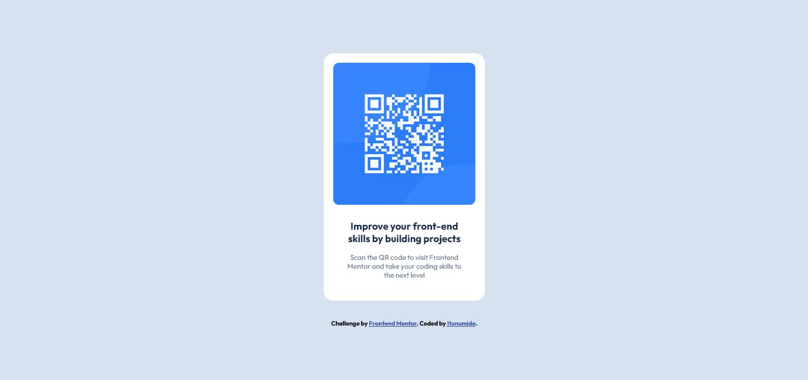

# Frontend Mentor - QR code component solution

This is a solution to the [QR code component challenge on Frontend Mentor](https://www.frontendmentor.io/challenges/qr-code-component-iux_sIO_H). Frontend Mentor challenges help you improve your coding skills by building realistic projects.

## Table of contents

- [Overview](#overview)
  - [Screenshot](#screenshot)
  - [Links](#links)
- [My process](#my-process)
  - [Built with](#built-with)
  - [What I learned](#what-i-learned)
  - [Continued development](#continued-development)
- [Author](#author)

## Overview

The challenge was to create a QR Code Component based on a given design and specifications. The component includes a QR code image and a small section of text, styled to align with the design guidelines provided by Frontend Mentor.

### Screenshot



### Links

- Solution URL:(https://github.com/itunumide/qr-code-component.git)
- Live Site URL:(https://qr-code-component-three-rosy.vercel.app)

## My process

### Built with

- Semantic HTML5 markup
- CSS for styling
- Flexbox for layout structure
- Mobile-first workflow

### What I learned

While working on this challenge, I gained better insight into creating small, reusable components with semantic HTML. A key takeaway was mastering CSS Flexbox to properly align content and ensure responsiveness. Here's a small snippet of the code I'm proud of:

```css
.container {
  width: 100%;
  height: 100%;
  display: flex;
  flex-direction: column;
  justify-content: center;
  align-items: center;
}
```

### Continued development

- Enhance responsiveness by exploring CSS Grid for more complex layouts.
- Improve accessibility by adding ARIA labels and better semantic tags.

## Author

- Website - (https://itunu-i-raji.vercel.app)
- Frontend Mentor - (https://www.frontendmentor.io/profile/itunumide)
- Twitter - (https://www.twitter.com/itunumide3)
